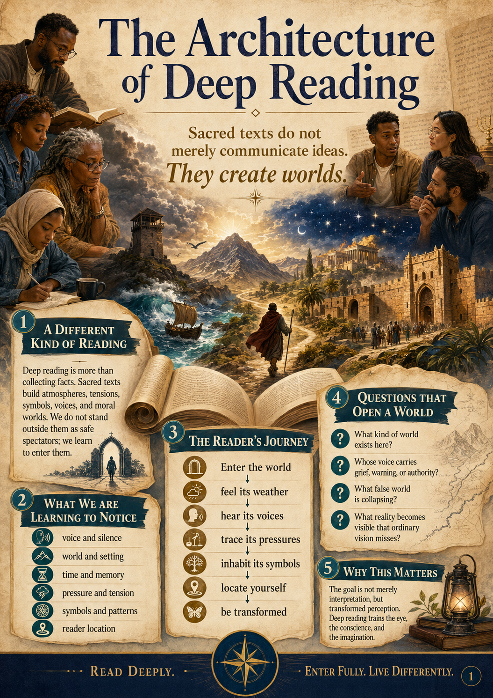

# The Architecture of Deep Reading

> **Sacred texts do not merely communicate ideas. They create worlds.**
>
> **The goal is not merely interpretation, but transformed perception.**

<p align="center">
  
</p>

## A visual curriculum for inhabiting sacred texts

**The Architecture of Deep Reading** is a forty-poster visual curriculum for readers, churches, classrooms, seminaries, study groups, and teachers who want to move beyond hurried extraction of religious information. It trains readers to enter the literary, emotional, symbolic, historical, theological, and pastoral worlds created by Scripture.

Prophetic literature—especially Isaiah—served as the primary training ground because prophecy combines poetry, politics, memory, symbolism, covenant, lament, judgment, hope, liturgy, apocalypse, and pastoral warning. The framework is intentionally broader, however, and can be used with the Psalms, Torah, narratives, wisdom literature, Gospels, epistles, and Revelation.

This is not a stack of decorative theology charts. It is a sequence of **intellectual-spiritual training environments**: a sacred atlas, a prophetic field manual, and a set of reading laboratories designed to form attention.

## The journey

The curriculum moves through four major movements:

1. **Enter the world** — slow down; ask WHO, WHAT, WHERE, WHEN, and WHY; feel the text’s weather and pressure.
2. **Train the interpretive imagination** — hear voices and silences; follow repetition, echoes, symbols, turns, contrasts, thresholds, and architecture.
3. **Read the human condition** — expose false worlds, fear, blindness, grief, desire, injustice, and pressured hope.
4. **Be transformed** — locate yourself, face resistance, read formationally, pray, discern communally, practice for life, and return with new eyes.

In one line:

> **Enter the world → feel its weather → hear its voices → trace its pressures → inhabit its symbols → locate yourself → be transformed.**

## The deep-immersion method

Before entering a difficult passage such as Isaiah 21, the first task is to construct a method of immersion—an architecture of reading. Otherwise, readers risk collecting observations without entering the text as a living theological world.

The guiding question is therefore larger than:

> **What does this passage mean?**

It becomes:

> **How do we inhabit prophetic Scripture deeply enough that its world, tensions, symbols, sounds, politics, fears, and theological pressures begin to work on us?**

That is a very different task.

Prophetic literature is not linear prose. It is **compressed revelation**, speaking simultaneously through poetry, politics, theology, memory, symbolism, covenant, emotion, history, liturgy, apocalypse, and pastoral warning. An exclusively analytical approach flattens this density. The prophets must be read multidimensionally.

### Twelve interpretive axes

The familiar questions WHO, WHAT, WHERE, WHEN, and WHY become doorways into a much larger field of perception.

| Axis | World-opening questions | What this trains us to notice |
|---|---|---|
| **1. WHO?** | Who speaks, sees, understands, remains silent, holds power, or appears powerful while already collapsing? Who is humanized—refugees, widows, captives, soldiers? Who represents more than themselves? | Voice, vision, silence, power, social location, symbolic identity |
| **2. WHAT?** | What genre is occurring—an oracle, lament, woe, vision, taunt, dirge, courtroom scene, apocalypse, or hymn? What movement unfolds: ascent/descent, exile/homecoming, judgment/restoration, blindness/sight, pride/humiliation? What is being unveiled? | Genre, movement, emotional arc, revelation |
| **3. WHERE?** | What kind of world exists here: wilderness, Zion, Babylon, Egypt, desert, mountain, sea, highway, ruins, gates, or watchtower? What covenant memory does the place carry? | Sacred geography and theological atmosphere |
| **4. WHEN?** | Is this historical, liturgical, prophetic, covenantal, or eschatological time? Are we in rebellion, exile, restoration, waiting, mourning, collapse, or hope? Does the text telescope past, present, and future? | Layered time, memory, crisis, horizon |
| **5. WHY?** | Why judgment, mercy, delay, concealment, symbolic imagery, or collapse before restoration? What false worship or false trust is being exposed? | Theological purpose, idolatry, moral pressure |
| **6. DEGREES** | What is the degree of judgment, hope, blindness, arrogance, faithfulness, collapse, or remnant survival? How does intensity rise or recede? | Escalation, proportion, symbolic and emotional intensification |
| **7. TEXTURE** | How does the text feel—violent, slow, dreamlike, heavy, fragmented, musical, repetitive, breathless, liturgical, nightmarish? Does it feel like thunder, courtroom fire, funeral poetry, military alarm, temple liturgy, or cosmic dream? | Emotional weather and the truth that form carries theology |
| **8. SYMBOLIC ECOLOGY** | Which images recur or cluster—mountains, rivers, stars, women, vineyards, beasts, deserts, gardens, cities, darkness/light, sleep/waking? What world do they create together? | Symbols as interacting systems rather than isolated code words |
| **9. EMPIRE ANALYSIS** | What empire is being critiqued? What seductions does it offer—security, wealth, military power, cultural prestige? How does empire mimic God, and how does it collapse? | Political theology without reducing the text to politics |
| **10. EXODUS / EXILE / RETURN** | Is the passage moving through bondage, wilderness, exile, judgment, return, restoration, or new creation? What earlier deliverance story is reverberating beneath it? | Canonical movement and covenant memory |
| **11. MESSIANIC PRESSURE** | Does the failure of ordinary rulers create pressure toward a righteous king, true shepherd, suffering servant, faithful remnant, or Spirit-anointed deliverer? | Hope moving toward God’s coming reign without forcing every verse into direct prediction |
| **12. READER LOCATION** | Where are we standing—Babylon, Zion, among the exiles, on the watchtower, among fugitives, with complacent elites, or inside a fearful remnant? What does the text expose or awaken in us? | Spiritual self-location and the end of safe spectatorship |

Good prophetic reading destabilizes the reader. **The prophets do not permit safe spectatorship.**

### The posture of deep attention

These habits are not a separate theological system or a specially named spiritual method. They describe the patient, disciplined, and integrative posture this project asks readers to bring to prophetic Scripture:

- sustaining attention rather than rushing toward extraction or conclusion
- reading multidimensionally across literary, historical, theological, political, emotional, and pastoral layers
- resisting reductions that make the text smaller, safer, or simpler than it is
- tracing patterns and echoes across the canon
- noticing how literary architecture, repetition, silence, imagery, and movement carry meaning
- remaining present to ambiguity without treating uncertainty as failure
- allowing genuine tensions to remain unresolved until the text itself provides movement or resolution
- holding symbolic and historical readings together rather than forcing a false choice between them

Prophetic texts are intentionally dense. They invite meditation, rereading, communal discernment, and spiritual self-examination. The aim is neither mental overexertion nor interpretive novelty, but faithful attention deep enough for the world of the text to challenge and reshape perception.

### Six flattenings to resist

1. **Flattening prophecy into prediction charts** — this kills the poetry and reduces unveiling to scheduling.
2. **Moralizing everything** — this ignores history, covenant, politics, and theology.
3. **Treating symbols woodenly** — prophetic imagery is fluid, cumulative, and relational.
4. **Ignoring literary form** — structure, rhythm, silence, and imagery carry meaning.
5. **Over-spiritualizing** — the prophets address economics, injustice, war, refugees, worship, corruption, and public life.
6. **Over-politicizing** — the text is theological before it is ideological.

### A chapter-level working framework

For sustained study, a passage can be explored through these interacting layers:

1. Surface narrative or oracle
2. Literary structure
3. Emotional atmosphere
4. Symbolic world
5. Historical setting
6. Political theology
7. Covenant theology
8. Exodus/exile patterns
9. Zion themes
10. Messianic trajectories
11. Human psychology
12. Pastoral implications
13. Canonical echoes
14. Contemporary resonance

This produces immersion rather than summary. Isaiah rewards this kind of reading more than almost any other biblical book, yet the method remains useful across the canon.

## Poster index

| Page | Poster | Movement |
|---:|---|---|
| 01 | [The Architecture of Deep Reading](posters/01-entering-the-world-of-the-text/01-the-architecture-of-deep-reading.png) | Entering the World of the Text |
| 02 | [Learning to Read Slowly](posters/01-entering-the-world-of-the-text/02-learning-to-read-slowly.png) | Entering the World of the Text |
| 03 | [Five Doorways into the World of the Text](posters/01-entering-the-world-of-the-text/03-five-doorways-into-the-world-of-the-text.png) | Entering the World of the Text |
| 04 | [WHO? — Voice, Vision, and Silence](posters/01-entering-the-world-of-the-text/04-who-voice-vision-and-silence.png) | Entering the World of the Text |
| 05 | [WHAT? — Movement, Genre, and Change](posters/01-entering-the-world-of-the-text/05-what-movement-genre-and-change.png) | Entering the World of the Text |
| 06 | [WHERE? — Setting, Atmosphere, and Sacred Geography](posters/01-entering-the-world-of-the-text/06-where-setting-atmosphere-and-sacred-geography.png) | Entering the World of the Text |
| 07 | [WHEN? — Time, Memory, and Horizon](posters/01-entering-the-world-of-the-text/07-when-time-memory-and-horizon.png) | Entering the World of the Text |
| 08 | [WHY? — Pressure, Exposure, and Purpose](posters/01-entering-the-world-of-the-text/08-why-pressure-exposure-and-purpose.png) | Entering the World of the Text |
| 09 | [The Weather of the Text](posters/01-entering-the-world-of-the-text/09-the-weather-of-the-text.png) | Entering the World of the Text |
| 10 | [When the Text Refuses to Settle](posters/01-entering-the-world-of-the-text/10-when-the-text-refuses-to-settle.png) | Entering the World of the Text |
| 11 | [Symbolic Pressure](posters/01-entering-the-world-of-the-text/11-symbolic-pressure.png) | Entering the World of the Text |
| 12 | [Voice and Silence](posters/02-training-the-interpretive-imagination/12-voice-and-silence.png) | Training the Interpretive Imagination |
| 13 | [Repetition and Accumulated Weight](posters/02-training-the-interpretive-imagination/13-repetition-and-accumulated-weight.png) | Training the Interpretive Imagination |
| 14 | [Pattern and Echo](posters/02-training-the-interpretive-imagination/14-pattern-and-echo.png) | Training the Interpretive Imagination |
| 15 | [Symbolic Ecology](posters/02-training-the-interpretive-imagination/15-symbolic-ecology.png) | Training the Interpretive Imagination |
| 16 | [Movement and Turning Points](posters/02-training-the-interpretive-imagination/16-movement-and-turning-points.png) | Training the Interpretive Imagination |
| 17 | [Contrast and Collision](posters/02-training-the-interpretive-imagination/17-contrast-and-collision.png) | Training the Interpretive Imagination |
| 18 | [Irony and Reversal](posters/02-training-the-interpretive-imagination/18-irony-and-reversal.png) | Training the Interpretive Imagination |
| 19 | [Thresholds and Crossings](posters/02-training-the-interpretive-imagination/19-thresholds-and-crossings.png) | Training the Interpretive Imagination |
| 20 | [Hidden Architecture](posters/02-training-the-interpretive-imagination/20-hidden-architecture.png) | Training the Interpretive Imagination |
| 21 | [Reading the Whole Field](posters/02-training-the-interpretive-imagination/21-reading-the-whole-field.png) | Training the Interpretive Imagination |
| 22 | [False Worlds and Collapsing Trusts](posters/03-reading-the-human-condition/22-false-worlds-and-collapsing-trusts.png) | Reading the Human Condition |
| 23 | [Power, Empire, and Idolatry](posters/03-reading-the-human-condition/23-power-empire-and-idolatry.png) | Reading the Human Condition |
| 24 | [Fear and False Security](posters/03-reading-the-human-condition/24-fear-and-false-security.png) | Reading the Human Condition |
| 25 | [Blindness and Misperception](posters/03-reading-the-human-condition/25-blindness-and-misperception.png) | Reading the Human Condition |
| 26 | [Lament, Grief, and Holy Sorrow](posters/03-reading-the-human-condition/26-lament-grief-and-holy-sorrow.png) | Reading the Human Condition |
| 27 | [Desire, Hunger, and Longing](posters/03-reading-the-human-condition/27-desire-hunger-and-longing.png) | Reading the Human Condition |
| 28 | [Justice, Mercy, and the Wounded Community](posters/03-reading-the-human-condition/28-justice-mercy-and-the-wounded-community.png) | Reading the Human Condition |
| 29 | [Hope Under Pressure](posters/03-reading-the-human-condition/29-hope-under-pressure.png) | Reading the Human Condition |
| 30 | [The Human Heart in the Text](posters/03-reading-the-human-condition/30-the-human-heart-in-the-text.png) | Reading the Human Condition |
| 31 | [What the Text Reveals About God and Humanity](posters/03-reading-the-human-condition/31-what-the-text-reveals-about-god-and-humanity.png) | Reading the Human Condition |
| 32 | [Reader Location](posters/04-reading-as-transformation/32-reader-location.png) | Reading as Transformation |
| 33 | [Resistance and Encounter](posters/04-reading-as-transformation/33-resistance-and-encounter.png) | Reading as Transformation |
| 34 | [Information Reading vs. Formation Reading](posters/04-reading-as-transformation/34-information-reading-vs-formation-reading.png) | Reading as Transformation |
| 35 | [Reading Postures](posters/04-reading-as-transformation/35-reading-postures.png) | Reading as Transformation |
| 36 | [Praying from Inside the Text](posters/04-reading-as-transformation/36-praying-from-inside-the-text.png) | Reading as Transformation |
| 37 | [Communal Reading and Shared Discernment](posters/04-reading-as-transformation/37-communal-reading-and-shared-discernment.png) | Reading as Transformation |
| 38 | [Questions That Open Worlds](posters/04-reading-as-transformation/38-questions-that-open-worlds.png) | Reading as Transformation |
| 39 | [The Lifelong Practice of Deep Reading](posters/04-reading-as-transformation/39-the-lifelong-practice-of-deep-reading.png) | Reading as Transformation |
| 40 | [Transformed Perception](posters/04-reading-as-transformation/40-transformed-perception.png) | Reading as Transformation |

## How to use the series

### As a booklet
Read the posters in order. Spend a full session with one image. Do the exercises in writing, then revisit the biblical passage without looking at the poster. The sequence is cumulative: later pages assume the habits cultivated earlier.

### As a classroom or church curriculum
Use one poster per lesson. Begin by reading a passage aloud, introduce one doorway, let students mark the text, and conclude with communal discernment and prayer. The posters are especially suited to projected teaching, printed handouts, hallway exhibits, adult formation, and small-group study.

### As a field guide
Choose the poster that matches the difficulty you are encountering:

- A confusing passage: **When the Text Refuses to Settle**
- Dense imagery: **Symbolic Pressure** or **Symbolic Ecology**
- A passage with repeated language: **Repetition and Accumulated Weight**
- Conflicting voices: **Voice and Silence**
- A moral or political crisis: **False Worlds and Collapsing Trusts** or **Power, Empire, and Idolatry**
- Personal defensiveness: **Reader Location** or **Resistance and Encounter**
- A dry season: **Hope Under Pressure** or **The Lifelong Practice of Deep Reading**

## A different kind of reading

The posters repeatedly resist several reductions:

| Information-only reading | Deep, formational reading |
|---|---|
| Extracts facts | Inhabits worlds |
| Seeks quick conclusions | Dwells in tension |
| Controls the text | Submits to the text’s witness |
| Treats symbols as labels | Feels their accumulated pressure |
| Reads as a spectator | Accepts being located and addressed |
| Finishes with explanation | Continues into prayer, obedience, and hope |

Interpretation is not rejected. It is deepened until disciplined attention becomes transformed perception.

## Repository organization

```text
posters/
├── 01-entering-the-world-of-the-text/
├── 02-training-the-interpretive-imagination/
├── 03-reading-the-human-condition/
├── 04-reading-as-transformation/
├── variants/
└── archive/
    ├── pre-series-concepts/
    ├── off-track-generations/
    └── unclassified-generated/
docs/
├── series-map.md
├── design-language.md
└── remediation-notes.md
metadata/
├── manifest.csv
└── manifest.json
```

The `variants/` and `archive/` directories are intentional. The creative process produced alternate wordings, duplicate generations, incorrect page numbers, and several design experiments. They are retained rather than silently discarded so that later remediation can be transparent and reversible.

## Archive integrity

- **55 generated PNG files** are currently tracked in the repository.
- The original manifest contains **55 records**; Pages 4 and 23 have now been restored and will be reconciled during the next metadata pass.
- **1 exact duplicate group** was detected by SHA-256.
- User-uploaded screenshots, contact sheets, and opaque UUID-named reference images were deliberately excluded.
- No poster was repaired or rewritten during repository assembly.

See [`metadata/manifest.csv`](metadata/manifest.csv) for dimensions, source filenames, hashes, duplicate groups, and curation notes. See [`docs/remediation-notes.md`](docs/remediation-notes.md) for known issues.

## Theological and pastoral posture

The series reads Scripture as a unified, many-voiced drama moving through creation, covenant, Exodus, wilderness, kingdom, exile, Zion, Messiah, cross, resurrection, Spirit, church, and new creation. It attends to literary beauty without separating form from theology; it names both consolation and confrontation; it resists moralism, proof-texting, triumphalism, and sentimentalism.

Where the text wounds, the reader is not rushed into soothing. Where it comforts, mercy is not diluted. Where it judges, judgment is allowed to serve redemption. Where it sings, reading becomes praise.

## Visual language

The series uses illuminated parchment, navy and antique gold, ornamental borders, books, scrolls, lanterns, compasses, roads, gates, cities, seas, wildernesses, and mountains. Diverse readers—including prominent Black and African American figures—appear not as decoration but as participants in learning, discernment, grief, hope, and communal interpretation.

The design goal is both didactic and liturgical: the reader should slow down simply by looking.

## Project status

This repository is a **working archive and provisional booklet**, not a declared final edition. Variants and duplicates are intentionally preserved for a later editorial pass. Pages retained elsewhere by the project owner can be added without disturbing the current manifest.

## A closing word

> Read attentively. Listen deeply. Discern faithfully. Live courageously.
>
> Enter the world of the text. Return with new eyes.
